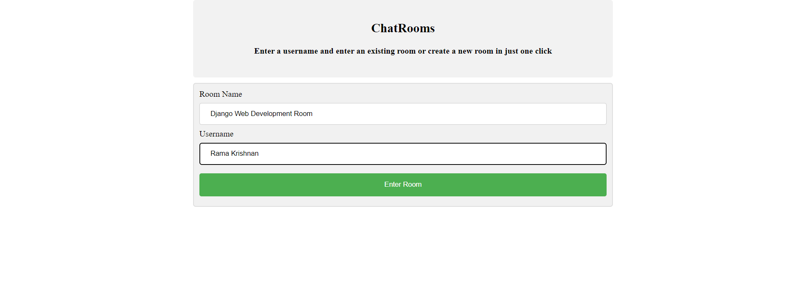

# ChatRoomWebApp - An open source chat room website for focused talks.



#### Welcome to ChatRoomWebApp, an open-source chat-room website for topic related talks!

### What is this website for?
It's for chatting related to a topic, for example gaming rooms, coding rooms, physics study room, home work discussion rooms etc. and finding great partners you can learn and have fun with.


### Why did you create this website?
I wanted to make a website where topic related talks can be done without any sort of distraction.
I have realized that when we discuss topics we learn more and this type of group learning stays with us for longer and it is also more practical.

### What did you use to build this website?
I used Python (Django) for the backend, SQLite for database management, Bootstrap for the frontend. I'm planning on adding PostgreSQL for database management and I am already working on a much better and styled version of this web app concept, I may have uploaded it on my github by the time you are seeing this, check for DomainExpansion in my GitHub (website name may change if I don't get proper domain name for website).

Real-time Chat Room Web App. Made with Django.
Backend written in Python and JavaScript.

---

## How to run this web app locally

### 1. Install the requirements within `requirements.txt` using pip

After cloning the repository onto your machine, navigate to the project's directory. For this step, the ideal setup would be creating and activating a virtual environment (venv) then installing all the requirements.

#### A) Venv setup

Run the following commands:
1) Create a venv with the name "ChatRoom_ENV"
2) Activate the venv

```console
python -m venv ChatRoom_ENV
ChatRoom_ENV\scripts\activate.bat
```

Now, from the project directory you can run:

```console
pip install -r requirements.txt
```

### 2. Migrate and run your server

1) Set yourself a `SECRET_KEY` in `settings.py`
2) Make the migrations to setup the tables in your SQLite database:

```console
python manage.py migrate 
```

3) Import all of the conjugate app data:

```console
python manage.py shell
from chatmain import chatmain_db_import
chatmain_db_import.chatroom_import_all()
exit()
```

4) Start up the app:

```console
python manage.py runserver
```

### 3. Want to contribute?

Thank you! That would be great. Please feel free to send any pull requests here.

